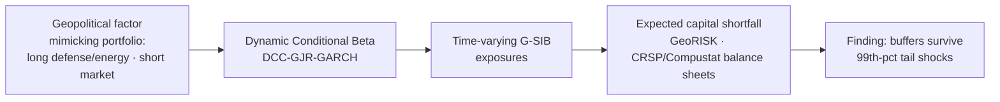

# GeoRISK — Stress Testing Bank Exposure to Geopolitical Risk
**MSc Research Project (15EC), VU Amsterdam**

Traditional bank stress tests focus on macro and credit risk. This project builds a **tradeable geopolitical risk factor** and asks: do US G-SIBs hold enough capital to survive a 99th-percentile geopolitical shock?

## Method
1. **Factor construction** — a "flight-to-safety" mimicking portfolio (long defense & energy, short broad market) turns geopolitical shock exposure into a priced, observable return series.
2. **Dynamic Conditional Beta** — DCC-GJR-GARCH estimates each G-SIB's *time-varying* exposure; static betas materially understate crisis sensitivity.
3. **Capital shortfall (GeoRISK)** — dynamic exposures × balance-sheet data (CRSP/Compustat) → expected capital shortfall under tail scenarios.

**Headline result:** large US banks maintain sufficient capital buffers to weather 99th-percentile geopolitical tail shocks.

## Repo contents
- `notebooks/georisk_pipeline.ipynb` — full pipeline (outputs stripped; re-run to regenerate)
- `figures/` — key exhibits
- `requirements.txt`

## Data
WRDS (CRSP/Compustat) — **licensed, not redistributed**. A WRDS account is required to reproduce; the notebook documents the exact pulls.
